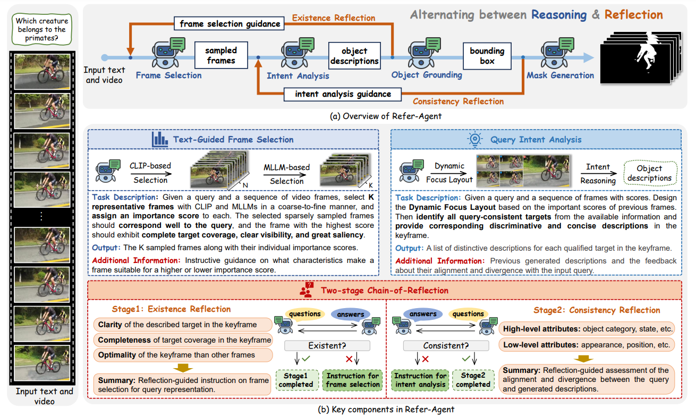

<div align="center">
<br>
<h2>Refer-Agent: A Collaborative Multi-Agent System with Reasoning and Reflection for Referring Video Object Segmentation</h2>

Haichao Jiang<sup>†</sup> &nbsp;
[Tianming Liang](https://tmliang.github.io/)<sup>†</sup> &nbsp;
[Wei-Shi Zheng](https://www.isee-ai.cn/~zhwshi/) &nbsp;
[Jian-Fang Hu](https://isee-ai.cn/~hujianfang/)* &nbsp;

Sun Yat-sen University &nbsp;

</div>

## 🎯 Framework



## 🚀 Environment Setup

```bash
# Clone the repo
git clone https://github.com/iSEE-Laboratory/Refer-Agent.git
cd Refer-Agent

# [Optional] Create a clean Conda environment
conda create -n refer-agent python=3.10 -y
conda activate refer-agent

# PyTorch 
conda install pytorch==2.5.1 torchvision==0.20.1 torchaudio==2.5.1 pytorch-cuda=12.4 -c pytorch -c nvidia

# Other dependencies
pip install -r requirements.txt
```

### Install SAM2

Refer-Agent uses SAM2 for mask propagation. Please install SAM2 following the [official instructions](https://github.com/facebookresearch/segment-anything-2):

```bash
cd sam2
pip install -e .
cd ..
```

Download SAM2 checkpoints and put them in `sam2/checkpoints/`:

```bash
cd sam2/checkpoints
bash download_ckpts.sh
cd ../..
```

### Download Ovis2.5-9B

Download Ovis2.5-9B weights:

```bash
huggingface-cli download --type model AIDC-AI/Ovis2.5-9B --local-dir ./AIDC-AI
pip install flash-attn==2.7.0.post2 --no-build-isolation
```

## 📦 Data Preparation
Please refer to [DATA.md](assets/DATA.md) for data preparation.

The directory struture is organized as follows.

```
Refer-Agent/
├── data
│   ├── ref_youtube_vos
│   ├── mevis
│   ├── ReVOS
│   ├── ReasonVOS
│   └── GroundMoRe
```

## 🌟 Evaluation

### Ref-YouTube-VOS
```bash
# Step1: Preprocess
PYTHONPATH=. python utils/preprocess_refer_youtube.py
PYTHONPATH=. python utils/Ovis_preprocess_query_refer_youtube.py -ng 8 --split valid

# Step2: Inference
PYTHONPATH=. python eval/Ovis_infer_refytb.py -ng 8 --split valid
```
Submit your result to the online evaluation [server](https://codalab.lisn.upsaclay.fr/competitions/3282#participate-submit_results).

### MeViS
```bash
# Step1: Preprocess
PYTHONPATH=. python utils/preprocess_mevis.py
PYTHONPATH=. python utils/Ovis_preprocess_query_mevis.py -ng 8 --split valid

# Step2: Inference
PYTHONPATH=. python eval/Ovis_infer_mevis.py -ng 8 --split valid
```
Submit your result to the online evaluation [server](https://www.codabench.org/competitions/12222/).

### ReVOS
```bash
# Step1: Preprocess
PYTHONPATH=. python utils/preprocess_revos.py
PYTHONPATH=. python utils/Ovis_preprocess_query_revos.py -ng 8 --split valid

# Step2: Inference
PYTHONPATH=. python eval/Ovis_infer_revos.py -ng 8 --split valid

# Step3: Evaluation
PYTHONPATH=. python eval/eval_revos.py
```

### ReasonVOS
```bash
# Step1: Preprocess
PYTHONPATH=. python utils/preprocess_reasonvos.py
PYTHONPATH=. python utils/Ovis_preprocess_query_reasonvos.py -ng 8 --split valid

# Step2: Inference
PYTHONPATH=. python eval/Ovis_infer_reasonvos.py -ng 8 --split valid

# Step3: Evaluation
PYTHONPATH=. python eval/eval_reasonvos.py
```

### GroundMoRe
```bash
# Step1: Preprocess
PYTHONPATH=. python utils/preprocess_reasonvos.py
PYTHONPATH=. python utils/Ovis_preprocess_query_reasonvos.py -ng 8 --split valid

# Step2: Inference
PYTHONPATH=. python eval/Ovis_infer_groundmore.py -ng 8 --split valid

# Step3: Evaluation
PYTHONPATH=. python eval/eval_groundmore.py
```

## 🙏 Acknowledgements

Our code is built upon [Ovis2.5-9B](https://huggingface.co/AIDC-AI/Ovis2.5-9B), [AL-Ref-SAM2](https://github.com/appletea233/AL-Ref-SAM2) and [SAM2](https://github.com/facebookresearch/sam2). We sincerely appreciate these efforts.

## 📝 Citation

If you find our work helpful for your research, please consider citing our paper:

```bibtex
@article{jiang2026refer,
  title={Refer-Agent: A Collaborative Multi-Agent System with Reasoning and Reflection for Referring Video Object Segmentation},
  author={Jiang, Haichao and Liang, Tianming and Zheng, Wei-Shi and Hu, Jian-Fang},
  journal={arXiv preprint arXiv:2602.03595},
  year={2026}
}
```
